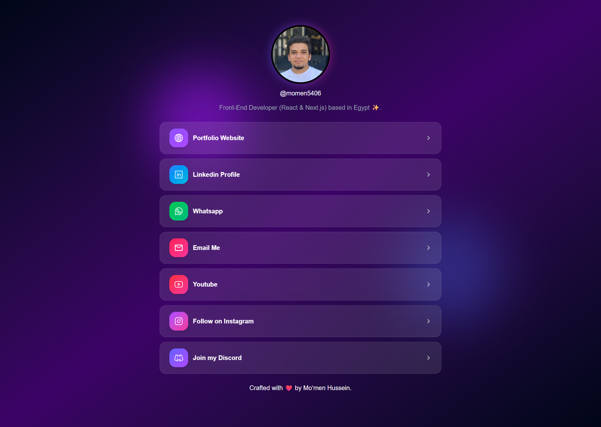

# [Linktree Profile Page Clone] | Day 1/30 Front-End Challenge

## 🚀 Live Demo
>
> **[View the Live Project Here](https://linktree-profile-page-clone.vercel.app/)**

## 🧐 About

This is project **#1** of my 30-Day Front-End Challenge. The goal of this challenge is to build 30 projects in 30 days to master React/Next.js and modern CSS.

This specific project is a **[Linktree Profile Page Clone]** designed to [aggregate social media links in one mobile-friendly interface].

## 🛠️ Tech Stack

* **Framework:** [Next.js]
* **Styling:** [Tailwind CSS]
* **Deployment:** Vercel

## 💡 Key Features

* Feature 1: Fully Responsive Design
* Feature 2: Dynamic Social Links
* Feature 3: Optimized Images with Next/Image

## 🧠 What I Learned

* **Concept 1:** How to configure 'next/image' for high-performance profile pictures.
* **Concept 2:** Structuring data arrays to map through components instead of hardcoding links.

Crafted with ❤️ by [Mo'men Hussein]
